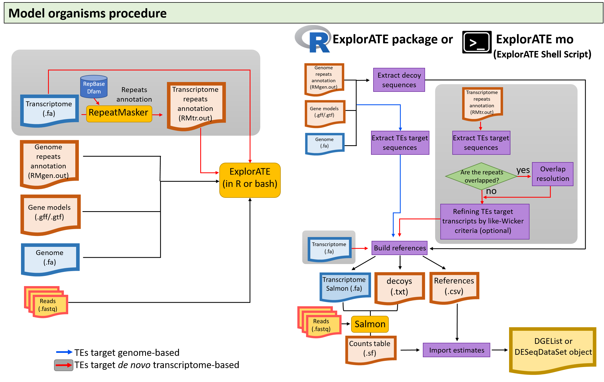
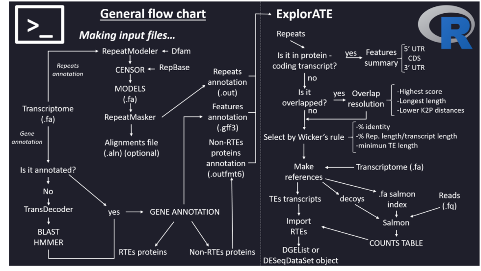

ExplorATE - *Explore Active Transposable Elements* -
====
### Description

**ExplorATE** (*Explore Active Transposable Elements*) is an R package for the exploration and identification of active transposons in RNA-seq data with or without reference genome. The package offers functions to manipulate the RepeatMasker output files, and allows to discriminate TEs-coding transcripts from those repeats that are co-transcribed with genes coding non-transposon proteins. Through a simple pipeline you can solve overlapping repeats that RepeatMasker cannot solve based on either higher score (`HS`), longer length (`LE`) or lower Kimura’s distances (`LD`). Additionally, the program offers optional refinement criteria for the annotation of TEs as a like-Wicker rule criterion based on the percentage of identity, the percentage of the repeat length respect to the transcript length, and a minimum length in base pairs. A decoy file and a transcriptome salmon-formated are created to be used for indexing and quantification with Salmon. Finally, a function is incorporated to import the transcripts quantification estimates into the R environment for subsequent differential expression analysis.

Flowchart with model organisms


Flowchart with non-model organisms


### Requirements

ExplorATE requires `bedtools` to be installed on your system. If `bedtools` is not installed on your OS, please refer to this [link](https://bedtools.readthedocs.io/en/latest/content/installation.html) and follow the instructions for your OS.

ExplorATE requires some previously installed R packages, select those packages that are not available in your environment:

```{r eval=FALSE}

install.packages(c("stringr","foreach","doParallel"))
install.packages(c("BiocManager","devtools")) 

BiocManager::install(c("readr","GenomicRanges", "IRanges","csaw", "edgeR","SummarizedExperiment","DESeq2", "tximport"))

```

### Install ExplorATE

Install ExplorATE from GitHub

```{r eval=FALSE}

devtools::install_github("FemeniasM/ExplorATEproject")

```

### User guide and vignette

Check the [vignette](https://femeniasm.github.io/ExplorATE_vignette/) and the [user_guide](https://femeniasm.github.io/ExplorATE_user_guide/)
