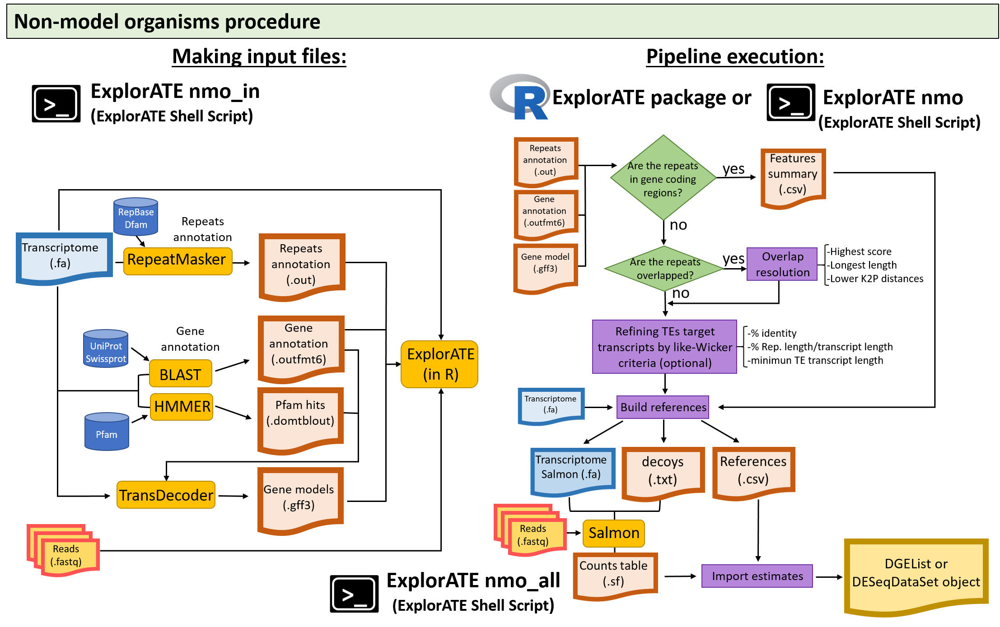

ExplorATE (Explore Active Transposable Elements) is an R package for the exploration and identification of active transposons in RNA-seq data. Our pipeline uses the alignment score comparisons (from the Selective Alignment algorithm) to simultaneously handle TE co-transcription (retained in introns regions or UTRs) and multi-mapping. 
The package offers functions to manipulate the RepeatMasker output files, and allows to discriminate target TEs from those repeats that are co-transcribed with genes coding non-transposon proteins. Through a simple pipeline you can solve overlaps of the repetitions that RepeatMasker cannot solve based on either highest score (HS), longer length (LE) or lower Kimura’s distances (LD). The transposons are finally annotated in a reference file. Additionally, the user can set a criterion similar to Wicker's rule. Under this criterion, the algorithm assigns target transcripts based on the percentage of identity for a class/family of TEs, the percentage for each TE class/family as the ratio between TE class/family length with respect to the transcript length, and a minimum of transcript length. The decoy file and the transcriptome salmon-formated created by ExplorATE, are used for indexing and quantification with Salmon. Finally, a function is incorporated to import the quantification estimates into the R environment for their subsequent differential expression analysis.

### INDEX
1.    [INSTALLING ExplorATE](#t1)
2.    [QUICK START](#t2)
3.    [MAKING INPUT FILES](#t3)
4.    [FILTERING COTRANSCRIBED REPEATS](#t4)
5.    [RESOLVING OVERLAPPING](#t5)
6.    [TRANSPOSONS ANNOTATION AND MAKING REFERENCE FILES](#t6)
7.    [SALMON QUANTIFICATION ESTIMATION](#t7)
8.    [IMPORT ESTIMATES TO R FOR DIFFERENTIAL EXPRESSION ANALYSIS](#t8)
9.    [RUN ExplorATE FOR NON-MODEL ORGANISMS FROM THE SHELL SCRIPT](#t9)
10.   [BIBLIOGRAPHY](#t10)

### 1. INSTALLING ExplorATE {#t1}

ExplorATE requires some previously installed packages. Make sure you have a recent R version (> 4.1.0) and select those packages that are not available in your environment:
```{r eval=FALSE}
#install complementary packages
install.packages(c("stringr","seqinr","foreach","doParallel", "dplyr"))
install.packages(c("BiocManager","devtools")) 
#BiocManager is required to install the packages below and devtools 
#is required if you want to install from GitHub 

BiocManager::install(c("readr","GenomicRanges", "IRanges","csaw", "edgeR",
                       "SummarizedExperiment","DESeq2", "tximport"))
```

You can install ExplorATE locally by downloading the file `ExplorATE_0.1.tar.gz` or install via GitHub using `devtools::install_github()`   
```{r eval=FALSE}
#install ExplorATE locally
install.packages("./ExplorATE_0.1.tar.gz", repos=NULL, type = "source")

#install ExplorATE from GitHub
devtools::install_github("FemeniasM/ExplorATEproject")
```

### 2. QUICK START {#t2}

ExplorATE allows the exploration of transposable elements in model and non-model organisms. Below is a quick example for each case, however we encourage the user to explore the extended pipeline step by step.

#### 2.1 Make TEs references in model organisms {#t2.1}

When the reference genome is available, the user has two alternatives to run the TEs analysis: (1) Using a set of TEs from intergenic regions of the genome as target, or (2) using a *de novo* transcriptome (and its RepeatMasker annotations) to define target TEs. In both cases, a genome-derived RepeatMasker file will be required to extract decoy sequences from genic regions. In addition, the user must have the genome in `.fasta` format, the gene model (in GFF or GTF format) file for the genome version, and a RepeatMasker file for the reference genome that can be obtained from the program's [website](http://www.repeatmasker.org/genomicDatasets/RMGenomicDatasets.html). The user must ensure that the RepeatMasker file for the genome and the version of the genome use the same nomenclature for the chromosomes. 
ExplorATE allows users to resolve repeat overlaps in RepeatMasker files based on: higher score ("HS"), a longer length ("LE") or lower divergence ("LD", Kimura's distances) of repeats. For overlap resolution, the current version of the ExplorATE shell script uses the python [script](https://github.com/rmhubley/RepeatMasker/blob/master/util/RM2Bed.py) included with the RepeatMasker program, which reduces execution times. However, the overlaps resolution with R functions may require more time. The overlaps resolution with functions from R package is described in section [5](#t5). 
The general flow chart for model organisms is shown in the figure below.

In the figure, blue arrows in the pipeline indicate flow when defining target TEs from intergenic regions. If a *de novo* transcriptome is used (red arrows and gray boxes) a transcriptome-derived RepeatMasker file is required.

ExplorATE has a shell [script](https://github.com/FemeniasM/ExplorATE_shell_script) with four execution modes: `mo`, for model organisms and three others (`nmo`, `nmo_in`, `nmo_all`) for non-model organisms. To download the ExplorATE script, navigate to the desired download directory and type:
```sh
git clone https://github.com/FemeniasM/ExplorATE_shell_script
```

The script can be run from the folder created in your directory:
```sh
cd ExplorATE_shell_script
```

To run the program, the user must define the mode and the flags corresponding to each mode:
```sh
bash ExplorATE [mode][flags]
```

The entire pipeline for model organisms can be run with the '`mo`' mode of the ExplorATE shell [script](https://github.com/FemeniasM/ExplorATE_shell_script) as shown below. To access the '`mo`' mode flags, the user must type: 
```sh
bash ExplorATE mo
```

The allowed flags are:
```
Usage:  
ExplorATE mo [flags]

Flags:
   -p threads [N] (1 default)     Number of therads
   -k kmer [N] (31 default)       k-mer size
   -c chromosome alias file       Replace the name of the chromosomes in the RepeatMasker file using
                                  a tab separated file with the first column indicating the desired
                                  chromosome name (e.g. the name of the gtf file) and in the second
                                  column the name to replace in the RepeatMasker file. If the file 
                                  contains more columns they will be ignored.
   -b bedtools binary path        Path to bedtools binary file. It is assumed by default that the 
                                  program is in your $PATH
   -s salmon binary path          Path to bedtools binary file (salmon default)
   -f fasta genome                Path to fasta genome (mandatory)
   -g gtf file                    Path to the gtf file for the genome version used (mandatory)
   -r RepeatMasker .out file      Path to the RepeatMasker file for the genome version used (mandatory) 
   -e library format ['pe']['se'] Indicates the format of the libraries: 'pe' for paired-end and 'se'
                                  for single-end reads. Supported extensions are: <.fq> or <.fastq>
                                  or <.fq.gz> or <.fastq.gz>. Paired end file names should contain 
                                  _R1 _R2. Example: sample_R1.fq.gz, sample_R2.fq.gz (mandatory)
   -l folder with fastq files     Path to folder with fastq files (mandatory)
   -o output directory path       Path to output directory (mandatory)
   -t fasta transcriptome **      Path to de novo transcriptome. Only required when target TEst are 
                                  based on the de novo transcriptome.
   -u transcriptome-dervied       Path to transcriptome-derived RepeatMasker file. Only required  
      RepeatMasker file **        when target TEst are based on the de novo transcriptome.
   -v overlap resolution          Criteria for overlapping resolution. Supported arguments:
                                  ['higher_score']['longer_element']['lower_divergence'] 
   -a .align file                 Alignments file derived from RepeatMasker (for genome) if 
                                  defined 'lower_divergence' as overlap resolution 
   -h help                        Print help
** if the TEs targets are based on a de novo transcriptome
```


As shown in the [vignette](https://femeniasm.github.io/ExplorATE_vignette/), the pipeline can be run on the test data for model organisms with the following command: 

```sh
bash ExplorATE mo -p 12 -f genome_hs.fa -g genemodel_hs.gtf -r repmask_hs.out -e pe \\
-l reads -o out_hs -v 'higher_score'
```
The above command defines target TEs from the repeats in intergenic regions. The user can explore repeats from a *de novo* transcriptome to define target TEs with the following command:
```sh
bash ExplorATE mo -p 12  -t trme_hs.fa -u repmask_trme_hs.out -f genome_hs.fa \\
-g genemodel_hs.gtf -r repmask_hs.out -e pe -l reads -o out_hs -v 'higher_score'
```
Note that the above command incorporates the `-t` and `-u` arguments for the *de novo* transcriptome and its corresponding RepeatMasker file.

By default `awk`, `bedtools`, `salmon` are assumed to be available in your `$PATH` environment variable.User must change paths when necessary.

The `ExplorATE mo` mode creates the reference files (target TEs and decoy sequences) and runs Salmon with the appropriate arguments. The Salmon estimates can then be imported with the function `ExplorATE::import.RTEs()` from the R package as shown in section [8](#t8)

#### 2.2 Make TEs references in non-model organisms  {#t2.2}

When there is no reference genome, ExplorATE takes a gene model file from TransDecoder and a gene annotation file from BLAST (`TransDecoder.gff3` and `BLAST.outfmt6` in the example below) to identify those repeats overlapping with protein-coding genes. Once the transcripts with co-transcribed repeats are identified, they are excluded from the RepeatMasker output file. The user can further refine his RepeatMasker file to resolve overlaps or apply selection criteria as shown in sections [5](#t5) and [6](#t5). A general flow chart of the pipeline is shown in the figure below.


As shown in the figure above, the pipeline can be run with functions from the R package or with the ExplorATE shell script. We will now describe the functions of the R package, and the following sections describe the functions of the shell script for non-model organisms.

The user can run each pipeline step separately or do them all together with the `mk.reference()` function as shown below.

```{r eval=FALSE}
RM.reference <- ExplorATE::mk.reference(RepMask = "path/to/RepeatMasker.out",
                                       gff3 = "path/to/TransDecoder.gff3",
                                       anot = "path/to/BLAST.outfmt6",
                                       stranded = T,
                                       cleanTEsProt = F,
                                       featureSum = T,
                                       outdir = "./outdir",
                                       rm.cotrans = T,
                                       overlapping = T,
                                       align = "path/to/RepeatMasker.aln",
                                       over.res = "LD",
                                       ignore.aln.pos = T,
                                       threads = 18,
                                       trme = "path/to/transcriptome.fa",
                                       by = "classRep",
                                       rule = c(80,80,80)
                                   )
```

With this function a reference file will be created containing the class/family of transposon for each transcript, initially excluding the co-transcribed repetitions and applying a selection criteria based on Wicker-like rule. In addition, the files `trmeSalmon.fasta` and `decoys.txt` will be created to run Salmon later.

When executing the `mk.reference()` function, it will initially ask us if the assigned classes/families are correct. You should check that there are no ambiguities in the labeling before executing the function. If the assigned classes/families are correct, you need to type `'y'+Enter` in the console.

#### 2.3 Run Salmon and import count estimates {#t2.3}

After creating the reference file, the next step is to perform the quantification estimate with Salmon. Linux users can use the `run.salmon()` function in R or run Salmon with the appropriate arguments.

```{r eval=FALSE}
ExplorATE::run.salmon(index = "sampleIndex",
                      decoys = "decoys.txt",
                      salmon_path = "path/to/salmon-latest_linux_x86_64/bin/salmon",
                      kmer = 31,
                      threads = 18,
                      trme = "path/to/trmeSalmon.fasta",
                      lib_dir = "path/to/reads",
                      pe_se = "pe"
                      )
```

The above function uses the `decoys.txt` and `trmeSalmon.fasta` files generated by `mk.reference()` function. If you decide to run Salmon in another way, be sure to use these files and the --gcBias, --validateMappings, --useVBOpt flags. You will find the details in [Patro et al. (2017)](https://www.nature.com/articles/nmeth.4197), [Love et al. (2016)](https://www.nature.com/articles/nbt.3682) and [Srivastava et al. (2020)](https://genomebiology.biomedcentral.com/articles/10.1186/s13059-020-02151-8). If you have any questions about how to run the Salmon program you can consult the documentation of [Salmon](https://salmon.readthedocs.io/en/latest/salmon.html#using-salmon). 

Finally the estimates are imported from Salmon. The `ExplorATE::import.RTEs()` function allows the estimates to be imported into R and creates a DGEList or DESeqDataSet object with the estimates corrected for changes in the average length of the transcripts across the samples.

```{r eval=FALSE}
y <- ExplorATE::import.RTEs(
  path.sal = "path/to/salmon/output",
  conditions = rep(c("S1", "S2", "S3"), each = 3),
  ref.sal = RM.reference,
  import_to = "edgeR"
)
```

The `y` object is ready to be used for differential expression analysis in edgeR. If you will use DESeq2 for later differential expression analysis, you must use the `import_to = "DESeq2"` argument. If the `import_to =` argument is omitted, the transcript-level estimates will be imported.

### 3. MAKING INPUT FILES {#t3}

Before using ExplorATE, you must generate/download files that contain detailed annotations of the repeats present in the transcriptome and/or genome, and the coding-proteins transcripts. Also, you'll want to generate some files that help refine the TEs annotation.
If you are working with a model organism you must download its reference genome and the appropriate GFF file for the genome version. RepeatMasker annotations to the model organisms can be found on the program's [website](https://www.repeatmasker.org/genomicDatasets/RMGenomicDatasets.html). If you work with non-model organisms or define target TEs from a *de novo* transcriptome, you will need to assemble the transcriptome and run RepeatMasker with the appropriate library for your organism.
ExplorATE requires gene models to identify co-transcribed elements. Users working with model organisms should ensure that they use the same version of the genetic model as the genome and the RepeatMasker file, and ensure that all files use the same chromosome nomenclature. When working with non-model organisms (and gene models are not available), ExplorATE uses a model of candidate coding regions identified with TransDecoder. This program performs an ORF homology search against the Pfam (using HMMER) and UniProt/SwissProt (using BLAST) databases, and writes a GFF3 file that is used by ExplorATE.

The ExplorATE shell script incorporates a function to help users create input files when working with non-model organisms. However, we recommend that users verify the quality of each of these files before running the pipeline. The `nmo_in` mode of the shell script that allows you to create the input files for non-model organizations is described below.

The allowed flags of the nmo_in mode can be accessed by typing:

```sh
bash ExplorATE nmo_in
```

```
Usage:  
ExplorATE nmo_in [flags]

Flags:
   -p threads [N] (1 default)     Number of therads
   -k kmer [N] (31 default)       k-mer size
   -r RepeatMasker binary path    Path to RepeatMasker binary file
   -o output directory path       Path to output directory (mandatory)
   -t de novo transcriptome       Path to de novo transcriptome file (mandatory) 
   -n blastp binary path          Path to blastp binary file. It is assumed by default that the 
                                  program is in your $PATH
   -m hmmer binary path           Path to hmmscan binary file. It is assumed by default that the 
                                  program is in your $PATH (require hmmer3)
   -d TransDecoder directory path Path to TransDecoder directory
   -u protein database            Path to protein database (e.g. SwissProt or Uniref90)
   -f Pfam database               Path to Pfam database
   -i RepeatMasker library        Path to custom library of repeats. Defines the argument to 
                                  RepeatMasker -lib. It is recommended to use a specific library 
                                  for the organism of interest.
   -j RepeatMasker species        If a custom library is not defined, a species closely related
                                  to the organism of interest can be used. This flag defines the 
                                  -species RepeatMasker argument and supports the same 
                                  specifications.See detailed information in the RepeatMasker 
                                  documentation.
   -h help                        Print help
```
The program requires defining the paths of each of the programs that are executed and the location of the protein databases.
Users can use RepeatMasker with a user-specified library with the `-i` argument, or use a library of a closely related organism with the `-j` argument. The `-j` argument supports all categories of the RepeatMasker `-species` flag. We recommend carefully set TE libraries to be used, as the quality of the estimates will depend on the quality of the repeats annotation. Users can identify repeats of curated libraries such as [Dfam](https://www.dfam.org/home) (profiles HMM derived from Repbase) and [Repbase](https://www.girinst.org/), or combine ExplorATE with specific pipelines for *de novo* TE annotation (for example, [RepeatModeler](https://www.repeatmasker.org/RepeatModeler/), [EDTA](https://github.com/oushujun/EDTA), or others reviewed in  [Goerner-Potvin and Bourque, 2018](https://www.nature.com/articles/s41576-018-0050-x)) and obtain reliable TE libraries for the studied organism.

The following code can be run to generate input files from a *de novo* transcriptome and a user-defined TE library:
```sh
bash ExplorATE nmo_in -p 12 -n <blastp binary path> -m <hmmerscan binary path> \\
-r <RepeatMasker binary path> -d <TransDecoder directory path> -u <SwissProt database> \\
-f <Pfam database> -i <user-defined TE library> -t < de novo transcriptome file> \\
-o <output directory>
```

#### 3.1 RepeatMasker repeats annotations {#t3.1}

As mentioned above, a detailed annotation of the repeats present in the transcriptome or genome is necessary. ExplorATE uses a RepeatMasker masking output file to identify the TEs present in each data set. RepeatMasker also allows you to generate an alignment file `.aln` with the output. This file can be used later in the resolution of overlapping repeats.
You can use the `read.RepMask()` function from the R package to read the RepeatMasker output file and verify it. The function `read.alignfile()` allows reading the alignment file and returns a `data.frame` with the identification of the sequence, the family of the assigned repetition. You can average the distances per sequence or per family of TEs (you can run `?read.alignfile()` for more details).

Some examples are shown below:
```{r eval=FALSE}
RM <- ExplorATE::read.RepMask("RM.out")
ALN <- ExplorATE::read.alignfile("RM.aln", average = T, by="classRep")
```

##### 3.1.1 Avoid ambiguities in repeats annotations {#t3.1.1}

It is possible that if different libraries are consulted there will be differences in the labeling of some repetitions. These ambiguities will cause problems later in the workflow so we must eliminate them. When we execute the function `rm.cotransRep()` it will ask us if the names assigned to the repetitions are correct (see the section [4](#t4)). The example below shows how we can unify the names. Suppose your RepeatMasker file contains ambiguities for SINEs elements and you want to unify according to RepBase groups.

First we check the repeats names, for this you can run these simple commands:

```{r eval=FALSE}
RM <- ExplorATE::read.RepMask("RM.out")
sort(unique(RM$classRep))
```

For example, if we find elements identified as `"NonLTR/SINE/7SL"` or `"NonLTR/SINE/tRNA"`, we can simply replace them with the correct assignment as follows:

```{r eval=FALSE}
RM$classRep <- gsub("NonLTR/SINE/7SL", "NonLTR/SINE/SINE1", RM$classRep)
RM$classRep <- gsub("NonLTR/SINE/tRNA", "NonLTR/SINE/SINE2", RM$classRep)
```

#### 3.2 Protein-coding genes annotations {#t3.2}

In non-model organism analysis, TEs identified in the RepeatMasker file that overlap with transcripts with candidate ORFs for non-transposon-related protein-coding genes are assigned as co-transcribed TEs. Candidate ORFs are obtained from a `GFF3` file generated with [TransDecoder](https://github.com/TransDecoder/TransDecoder/wiki), and we recommend running it with BLASTP and Pfam searches retaining only the best ORF. The file can be explored with the following functions of the R package:

```{r eval=FALSE}
GFF3 <- read.gff3("TransDecoder.gff3")
head(GFF3)
```

BLAST-derived protein annotations should be in output format 6, and are used to identify TEs that overlap with coding genes. Annotations for transposon proteins (such as reverse transcriptases, endonucleases, transposases, tyrosine recombinases, etc.) should be excluded from the annotations file as they could lead to misassignment of target TEs as co-transcribed elements. Similarly, those proteins that correspond to TEs but are mis-annotated as another protein (e.g., viral proteins) can generate false co-transcripts. The user must purge the protein annotations file to avoid these assignment errors. ExplorATE incorporates a `cleanTEsProt` argument from the `rm.cotransRep()` function (described in the next [section](#t4)) to exclude conflicting proteins from the annotation file, but we recommend that users check the protein annotations in each particular case. The `cleanTEsProt` argument requires the protein annotations in UniProt/Swiss-Prot ID format (e.g. "PGBD2_HUMAN" or "sp|Q6P3X8|PGBD2_HUMAN"). Users can explore the annotation file as follows:

```{r eval=FALSE}
GENE.ANOT <- read.outfmt6("BLAST.outfmt6")
head(GENE.ANOT)
```

Additionally, ExplorATE identifies whether the co-transcribed TEs are in UTR or CDS regions and generates an output file with this information with the `featureSum = T` argument from the `rm.cotransRep()` function (described in the next [section](#t4). 

### 4. FILTERING COTRANSCRIBED REPEATS {#t4}

A fundamental step in the ExplorATE pipeline (with or without reference genome) is the removal of elements co-transcribed with genes. This allows to refine the set of candidate TEs and define sequences that will be used as decoys in quantification with Salmon. The `rm.cotransRep()` function from the R package remove co-transcribed TEs from the RepeatMasker file. As mentioned above, the function requires a annotations file and a gene model file:

```{r eval=FALSE}
RM.cotransClean <- ExplorATE::rm.cotransRep(RepMask = "RM.out",
                                       gff3 = "TransDecoder.gff3",
                                       anot = "BLAST.outfmt6",
                                       stranded = T,
                                       cleanTEsProt = F,
                                       featureSum = T,
                                       outdir = "./outdir")
```

The input files can be assigned as absolute paths, or reletive to the working directory (as shown in the above function). Alternatively elements from the R environment can be assigned. In the following example we correct the names of the SINE elements in the RepeatMasker file before to remove co-transcribed elements, , and we use the `RepMask`, `GenModel` and `GenAnot` elements from the R environment in the function `rm.cotransRep ()`:

```{r eval=FALSE}
RepMask <- ExplorATE::read.RepMask("RM.out")
GenAnot <- read.outfmt6("BLAST.outfmt6")
GenModel <- read.gff3("TransDecoder.gff3")

RM$classRep <- gsub("NonLTR/SINE/7SL", "NonLTR/SINE/SINE1", RM$classRep)
RM$classRep <- gsub("NonLTR/SINE/tRNA", "NonLTR/SINE/SINE2", RM$classRep)

RM.cotransClean <- ExplorATE::rm.cotransRep(RepMask = RepMask,
                                       gff3 = GenModel,
                                       anot = GenAnot,
                                       stranded = T,
                                       cleanTEsProt = F,
                                       featureSum = T,
                                       outdir = "./outdir")

```

As mentioned in section [3.2](#t3.2), the argument `cleanTEsProt` refers to whether the annotations file `*.outfmt6` contains TEs-related proteins. We suggest that the user previously carefully remove TEs-related proteins from the `*.outfmt6` file and by default the program will not remove such proteins. User can change the default by setting `cleanTEsProt = TRUE` to exclude preset conflicting proteins from the `*.outfmt6` file (see section [3.2](#t3.2)).

If the argument `featureSum = T` additional files are created containing a summary of the protein-coding transcripts with co-transcribed TEs (`features.summary.*`).

### 5. RESOLVING OVERLAPPING {#t5}

The RepeatMasker output file may contain overlapping repeats when the program cannot resolve them automatically. The users can resolve these overlaps with the python [script](https://github.com/rmhubley/RepeatMasker/blob/master/util/RM2Bed.py) included with RepeatMasker before run ExplorATE. Alternatively, users can resolve overlaps with ExplorATE. The python script is included in the current version of shell script ExplorATE, and the ExplorATE R package include the `ovlp.res()` function. Similarly to the python script, this function allows resolves overlaps by the higher score ("HS"), a longer length ("LE") or lower divergence ("LD") set with the `over.res =` argument. 
The ExplorATE function defines the following criteria for assigning a TE class/family to an overlapping region: 1) When two repeats partially overlap, the overlapping bases are assigned to the item with the best score. 2) If one repeat is contained within another, the repeat with the lowest score is discarded. 3) If two items have the same score, they are assigned based on the first item in the RepeatMasker file.
The `ovlp.res()` function admit arguments from other package' functions, therefore it is possible to resolve overlaps and exclude co-transcribed elements from the RepeatMasker file with the same function shown below:

```{r eval=FALSE}
RM.ovlp.res <- ExplorATE::ovlp.res(RepMask = "RM.out",
                                       gff3 = "TransDecoder.gff3",
                                       anot = "BLAST.outfmt6",
                                       stranded = T,
                                       cleanTEsProt = F,
                                       featureSum = T,
                                       outdir = "./outdir",
                                       rm.cotrans = T,
                                       ignore.aln.pos = T,
                                       threads = 18,
                                       align = "RM.aln",
                                       over.res = "LD",
                                   )
```

The argument `rm.cotrans = T` indicates that the co-transcribed elements should be removed. As mentioned in the previous section, we recommend that you perform the removal of proteins associated with transposable elements in the `.outfmt6` file, and the `cleanTEsProt` is `FALSE` (default). If a RepeatMasker file is used in which the co-transcribed repeats have already been removed, the corresponding code is:

```{r eval=FALSE}
RM.ovlp.res <- ExplorATE::ovlp.res(RepMask = RM.cotransClean,
                                    align = "RM.aln",
                                    over.res = "LD",
                                    ignore.aln.pos = T,
                                    threads = 18,
                                  )
```

Notice that the output directory `outdir =` is only required if `featureSum = T` and the alignments file `align =` is only required if "low divergence" is used as the resolution parameter (`over.res = "LD"`). When using "low divergence" (LD) as an overlap resolution strategy, the `ignore.aln.pos` argument must be added. This argument indicates whether the base positions of the alignment file should be ignored (`ignore.aln.pos = T`) or not (` ignore.aln.pos = F`). This argument is useful for resolving overlaps for divergence as there may be discrepancies in the positions between the alignment file and the RepeatMasker output file. When the positions are ignored (`ignore.aln.pos = T`), the mean of each TE class/family for each transcript is used to resolve overlaps.

The `ovlp.res()` function allows parallel processing. Users can select the number of cores with the `threads =` argument. 

### 6. TRANSPOSONS ANNOTATION AND MAKING REFERENCE FILES {#t6}

After remove co-transcribed repeats and resolve overlaps in the RepeatMasker file, the user must annotate the transcripts that potentially correspond to active TEs (target TEs) and define the sequences to be used as decoys in the quantification of Salmon. ExplorATE also allows set a criterion similar to Wicker’s rule (([Wicker et al. (2007)](https://www.nature.com/articles/nrg2165))) to define the target TEs. Under this criterion, the algorithm assigns target transcripts based on the percentage of identity for a class/family of TEs, the percentage for each TE class/family as the ratio between TE class/family length with respect to the transcript length, and a minimum of transcript length. The default ‘80-80-80’ Wicker-like rule  is a selection criterion where the transcripts will be considered targets if they have a TE class/family annotation with >80% identity, represents >80% of the transcript length, and target transcripts must have at least 80bp in length. The user can change the default values of the Wicker-like criterion to make it more or less stringent. 
The `Wickerlike.rule()` function of the ExplorATE package allows you to apply the Wickerlike rule. In the following example, the `Wickerlike.rule()` function will annotate as a target ET those transcripts with the requirements: TE with 80% identity that represent at least 60% of the transcript, and the transcripts are at least 100 bp in length.

```{r eval=FALSE}
like.WickerRule(
  RepMask,
  by = "classRep",
  rule = c(80, 60, 100),
  best.by = NULL,
  custom.lengths = NULL
)
```
When there is more than one family of TEs per transcript with assigned Wicker-like rule criteria, the user can set whether to annotate all matches (`best.by = NULL`) or only annotate the best match per transcript. When the best match is annotated, the longest family (`best.by = 'total_repeat_length'`) or the family with the best identity score (`best.by = 'per_identity'`) can be used as criteria. Further, the function allows to set user-defined transcripts lengths with the `custom.lengths` argument. 

#### 6.1 Building reference files with a single function {#t6.1}

ExplorATE incorporates a function that integrates all the functions described above. The `mk.reference()` function allows to create the reference files directly avoiding execute functions step-by-step. Here is an example:

```{r eval=FALSE}
RM.reference <- ExplorATE::mk.reference(RepMask = "RM.out",
                                       gff3 = "TransDecoder.gff3",
                                       anot = "BLAST.outfmt6",
                                       stranded = T,
                                       cleanTEsProt = F,
                                       featureSum = T,
                                       outdir = "./outdir",
                                       rm.cotrans = T,
                                       overlapping = T,
                                       align = "RM.aln",
                                       over.res = "LD",
                                       trme = "transcriptome.fa",
                                       ignore.aln.pos = T,
                                       threads = 18,
                                       by = "classRep",
                                       rule = c(90,80,100)
                                   )
```

In this example, the argument `overlapping = T` indicates  that the Repeatmasker input file requires resolving overlaps. Further, the argument `rule = c(90,80,100)` indicates  the parameters for the Wicker-like rule. The `by =` argument indicates whether the classification should be done at the TE class, family or name level. For example, if `by = "classRep"` is set, the column "classRep" from the RepeatMasker file will be used.

If you start from a processed file, *i.e.* without co-transcribed repeats or overlaps, you could run a code like the following:

```{r eval=FALSE}
RM.reference <- ExplorATE::mk.reference(RepMask = RM.ovlp.res,
                                       outdir = "./outdir",
                                       trme = "transcriptome.fa",
                                       by = "classRep",
                                       rule = c(90,80,100)
                                   )
```

The `mk.reference()` function returns a `data.frame` with annotated target TEs transcripts and creates three files in the output directory: a `reference.csv` file with the target TE annotations, a `decoy.txt` file with transcripts defined as decoys, and a `.fasta` file (`trmeSalmon.fasta`) with target TEs and decoy sequences to be used in Salmon quantification.

### 7. SALMON QUANTIFICATION {#t7}

The [Salmon](https://combine-lab.github.io/salmon/getting_started/) program is widely used in the transcripts quantification. ExplorATE implements the Selective Alignment strategy through Salmon to reduce spurious mapping produced by multimapper reads derived from co-transcribed TEs. The users can run Salmon locally or, run it with the `run.salmon()` function from ExplorATE package. If you have questions about how to run the program locally, see the detailed Salmon's [documentation](https://salmon.readthedocs.io/en/latest/). Make sure to use the `decoy.txt` file and the `trmeSalmon.fasta` transcriptome generated by the `mk.reference()` function. If Salmon is installed, users can run the following command to run Salmon with the ExplorATE function. 

```{r eval=FALSE}
ExplorATE::run.salmon(index = "sampleIndex",
                      decoys = "decoy.txt",
                      salmon_path = "path/to/salmon-latest_linux_x86_64/bin/salmon",
                      kmer = 31,
                      threads = 18,
                      trme = "path/to/trmeSalmon.fasta",
                      lib_dir = "path/to/reads",
                      pe_se = "pe"
                      )
```

Details of the Salmon procedure are described in [Patro et al. (2017)](https://www.nature.com/articles/nmeth.4197), and the Selective Alignment approach is described in [Srivastava et al. (2020)](https://genomebiology.biomedcentral.com/articles/10.1186/s13059-020-02151-8).

### 8. IMPORT ESTIMATES TO R FOR DIFFERENTIAL EXPRESSION ANALYSIS {#t8}

After running Salmon, the estimates must be imported into the R environment and objects (e.g., DGEList or DESeqDataSet for edgeR and DESeq analyses respectively) must be created to to perform the subsequent differential expression analysis. The `import.RTEs()` function imports the estimates using the `tximport` package (see [Soneson et al. (2015)](https://f1000research.com/articles/4-1521/v1) for more details). The `import.RTEs()` function directly creates an offset that corrects the estimates for changes in the average transcripts length across samples. The following code shows an example to create a DGEList object:

```{r eval=FALSE}
y <- ExplorATE::import.RTEs(
  path.sal = "path/to/salmon/output",
  conditions = rep(c("S1", "S2", "S3"), each = 3),
  ref.sal = RM.reference,
  import_to = "edgeR"
)
```

In the example above, the argument `import_to = "edgeR"` was selected to create a DGEList object. Additionally the `import.RTEs()` function will add a CPMs matrix to the DGEList object. Users can continue with the dispersion estimation functions in edgeR. For more details, see the [edgeRUserGuide](https://bioc.ism.ac.jp/packages/2.11/bioc/vignettes/edgeR/inst/doc/edgeRUsersGuide.pdf). More details of the edgeR package can be found in [Robinson et al. (2010)](https://academic.oup.com/bioinformatics/article/26/1/139/182458). 

Alternatively, you can select `import_to = "DESeq2"` and continue with the `DESeq()` function (see [DESeq2 vignette](http://bioconductor.org/packages/devel/bioc/vignettes/DESeq2/inst/doc/DESeq2.html) and [Love et al. (2014)](https://genomebiology.biomedcentral.com/articles/10.1186/s13059-014-0550-8) for more details). If neither option is selected, the transcript-level estimates without offset will be imported.

### 9. RUN ExplorATE FOR NON-MODEL ORGANISMS FROM THE SHELL SCRIPT {#t9}

The ExplorATE shell script has three modes of execution for non-model organisms. The `nmo_in` mode allows to create input files as described in section [3](#t3), and then the pipeline can be run by use functions from the R ExplorATE package (mentioned above), or with the `nmo` mode from the shell script (see figure in section [2.2](#t2.2)). A third mode `nmo_all` is a fusion of the `nmo_in` and `nmo` modes that allows to create the input files and run the pipeline simultaneously. The `nmo` mode is described below, the flags for this mode are shown below:
```sh
bash ExplorATE nmo
```

```
Usage:  
ExplorATE nmo [flags]

Flags:
   -p threads [N] (1 default)     Number of therads
   -k kmer [N] (31 default)       k-mer size
   -b bedtools binary path        Path to bedtools binary file. It is assumed by default that the 
                                  program is in your $PATH
   -e library format ['pe']['se'] Indicates the format of the libraries: 'pe' for paired-end and 'se'
                                  for single-end reads. Supported extensions are: <.fq> or <.fastq>
                                  or <.fq.gz> or <.fastq.gz>. Paired end file names should contain 
                                  _R1 _R2. Example: sample_R1.fq.gz, sample_R2.fq.gz (mandatory)
   -l folder with fastq files     Path to folder with fastq files (mandatory)
   -o output directory path       Path to output directory (mandatory)
   -t de novo transcriptome       Path to de novo transcriptome file (mandatory) 
   -s salmon binary path          Path to bedtools binary file (salmon default)
   -n gene annotation file        Path to gene annotation file from BLAST in output format 6 
   -d TransDecoder gff3 file      Path to .gff3 gene models file from TransDecoder (mandatory)
   -w Wicker-like rule            Comma separated values indicating respectively
                                  -Percentage of identity: calculated as 100 minus the percentage 
                                  of divergence (from RepeatMasker file) for each TE class/family
                                  -Percentage of length: ratio between TE class/family length with 
                                  respect to total the transcript length
                                  -minimum length of the transcript: minimum transcript length
                                  ('0,0,0' default)
   -v overlap resolution          Criteria for overlapping resolution. Supported arguments:
                                  ['higher_score']['longer_element']['lower_divergence'] 
                                  ('higher_score' default)
   -x split repeats by            Indicates if the target TEs will be annotated by ['name']['family']
                                  ['subclass']
   -q annotate target TEs by      Indicates if the target TE sequences will be fragments or whole 
                                  transcripts ['transcripts']['fragments'] ('transcripts' default)
   -a .align file                 Alignments file derived from RepeatMasker (for genome) if defined
                                  'lower_divergence' as overlap resolution 
   -h help                        Print help
```

A modification of the following code can be used to run the ExplorATE pipeline using the shell script's `nmo` mode:

```sh
bash ExplorATE nmo -p 12 -b <bedtools binary path> -e pe -l reads  -n <blast output file> \\
-d <TransDecoder output file> -w 80,80,80 -v 'higher_score' -x 'subclass' -q 'transcripts' \\
-t < de novo transcriptome file> -o <output directory>
```
Similar to the functions in the R package, the shell script generates salmon output files for each library. The estimates can be imported into the R environment with the `import.RTEs()` function as described in section [8](#t8).


### 10. BIBLIOGRAPHY {#t9}

Goerner-Potvin, P., Bourque, G. Computational tools to unmask transposable elements. Nat Rev Genet 19, 688–704 (2018). https://doi.org/10.1038/s41576-018-0050-x

Haas, B., Papanicolaou, A., Yassour, M. et al. De novo transcript sequence reconstruction from RNA-seq using the Trinity platform for reference generation and analysis. Nat Protoc 8, 1494–1512 (2013). https://doi.org/10.1038/nprot.2013.084

Love, M. I., Huber, W. & Anders, S. Moderated estimation of fold change and dispersion for RNA-seq data with DESeq2. Genome Biol 15, 550 (2014). https://doi.org/10.1186/s13059-014-0550-8

Love, M. I., Hogenesch, J. & Irizarry, R. Modeling of RNA-seq fragment sequence bias reduces systematic errors in transcript abundance estimation. Nat Biotechnol 34, 1287–1291 (2016). https://doi.org/10.1038/nbt.3682

Patro, R., Duggal, G., Love, M. I. et al. Salmon provides fast and bias-aware quantification of transcript expression. Nat Methods 14, 417-419 (2017). https://doi.org/10.1038/nmeth.4197

Robinson M. D., McCarthy D. J. , Smyth G. K. edgeR: a Bioconductor package for differential expression analysis of digital gene expression data. Bioinformatics 26(1), 139–140 (2010). https://doi.org/10.1093/bioinformatics/btp616

Smit, A., Hubley, R & Green, P. RepeatMasker Open-4.0, (2013-2015). http://www.repeatmasker.org

Soneson C., Love M. I. and Robinson M. D. Differential analyses for RNA-seq: transcript-level estimates improve gene-level inferences. F1000Research 4(1521), (2015). https://doi.org/10.12688/f1000research.7563.1

Srivastava, A., Malik, L., Sarkar, H. et al. Alignment and mapping methodology influence transcript abundance estimation. Genome Biol 21, 239 (2020). https://doi.org/10.1186/s13059-020-02151-8

The UniProt Consortium. UniProt: a worldwide hub of protein knowledge, Nucleic Acids Research 47(D1), D506–D515 (2019). https://doi.org/10.1093/nar/gky1049

Wicker, T., Sabot, F., Hua-Van, A. et al. A unified classification system for eukaryotic transposable elements. Nat Rev Genet 8, 973–982 (2007). https://doi.org/10.1038/nrg2165


